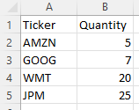
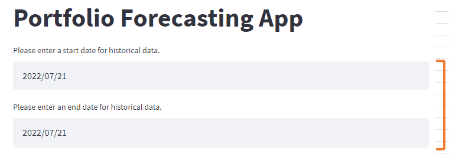
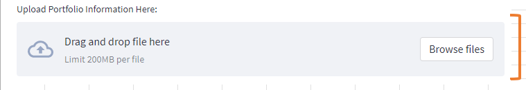
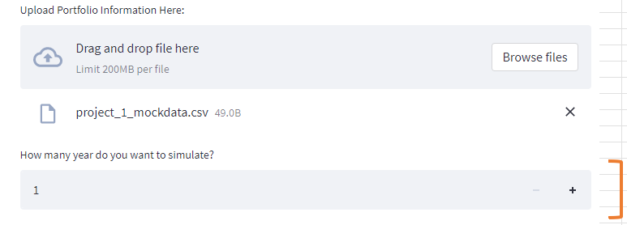
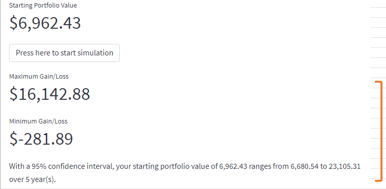

# Project 1 Portfolio Forecasting App

[Portfolio Forecasting App](https://jkang-project-1-forecasting-appfinal-appforecasting-app-g93q8s.streamlitapp.com/) 

**Welcome to our Portfolio Forecasting App. This was created to be able to predict the theoretical performance
of a portfolio of stocks using historical close price data and a Monte Carlo simulation.**

## About

The simulator uses a Streamlit dashboard. A user will choose the start and end date range that they would like to pull historical data. From their, the user can upload a csv file that contains the symbols of stocks they wish to pick as well as the quantity. After, the user will pick how long they wish to hold their stocks. With all the parameters set, the simulator can be started to see how their portoflio will perform based on the historical close price data from the date range chosen and length of time to hold the stocks. 

---

## Technologies
This project has been created with the following technologies:
* Python
* Streamlit
* Pandas
* Alpaca
* Jupyter Labs

---

## User Guide

The source code is currently hosted in a Github repository at the following link: 
https://github.com/jkang1990amg/Project_1_Forecasting_App

The Portfolio Forecasting App is run using a Streamlit dashboard. To run the app, click on the Streamlit link at the top of this README.md file called "Portfolio Forecasting App".

In order for the app run, you must create a csv file that contains a list of symbols of the stocks you wish to choose. You must also include a quantity of each stock chosen. The following screenshot shows an example csv file. **Your csv file must match the format of the example:

Choose the beginning and end date of historical data you wish to pull. 

Once you have choosen your start and end dates, upload the csv file to the Streamlit dashboard section that says "upload file".

After the csv file has been uploaded, choose the length of time you wish to hold your stock.

Once all the parameters have been completed, click the "start" button for the app to run. After the app finishes running, the max and min gain or loss as well as the 95% confidence interval of the portfolio's total value will display.

---

## Contributors

The Portfolio Simulator application created by:

Sam Eberts 

Souk Phoumiphak 

Joe Verhei 

Jonathan Kang

Advisor: Kyle Gee

---

## License

No licenses required.
